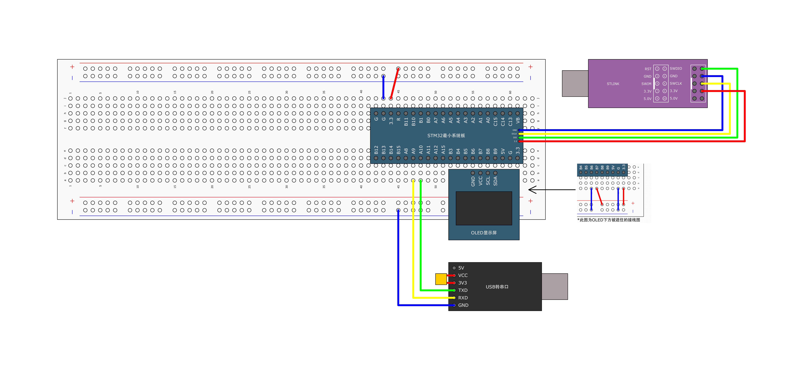

# OLED视频播放器

将MP4视频实时转换为128×64黑白画面，通过串口发送到STM32驱动的0.96寸OLED显示屏上播放。

## 效果演示

PC端播放视频 → CH340(USB转串口) → STM32F103C8T6 → 0.96寸OLED(SSD1306/I2C)

预览窗口会同步显示正在发送到OLED的画面，按 `Q` 键退出。

## 硬件需求

| 硬件 | 型号 | 数量 |
|------|------|------|
| 主控 | STM32F103C8T6（蓝色小板/最小系统板） | 1 |
| 屏幕 | 0.96寸OLED，4针I2C接口（SSD1306驱动） | 1 |
| 下载器 | ST-Link V2 | 1 |
| 串口模块 | CH340 USB转TTL | 1 |
| 杜邦线 | 母对母 | 若干 |

## 硬件接线

### OLED ↔ STM32（I2C）

| OLED引脚 | STM32引脚 | 说明 |
|----------|-----------|------|
| GND | G | 电源地 |
| VCC | 3.3V | 电源正（3.3V） |
| SCL | PB8 | I2C时钟线 |
| SDA | PB9 | I2C数据线 |

### CH340 ↔ STM32（UART）

| CH340引脚 | STM32引脚 | 说明 |
|-----------|-----------|------|
| GND | G | 共地 |
| TXD | PA10 | 串口接收（交叉连接） |
| RXD | PA9 | 串口发送（交叉连接） |

> **注意**：TXD接RX，RXD接TX，是交叉连接！GND必须接，否则通信失败。

### 实物接线图



## 通信协议

```
帧格式： [0xAA] [1024字节图像数据]

同步头：  0xAA（1字节），告诉STM32新帧开始
图像数据：8页 × 128列 = 1024字节，OLED显存原始格式

波特率：  921600 bps
数据格式：8N1（8数据位、无校验、1停止位）
```

## 目录结构

```
├── oled.py                  # PC端Python脚本（视频播放+串口发送）
├── STM32/
│   └── Keil工程/
│       ├── Project.uvprojx  # Keil MDK-ARM 工程文件
│       ├── User/
│       │   └── main.c       # 主程序
│       ├── Hardware/
│       │   ├── OLED.c/h     # OLED驱动（SSD1306, 软件I2C）
│       │   ├── OLED_Data.c/h# 字模/图像数据
│       │   └── Serial.c/h   # 串口驱动（含帧同步）
│       ├── System/
│       │   └── Delay.c/h    # 延时函数
│       ├── Library/         # STM32标准外设库
│       └── Start/           # 启动文件+时钟配置
└── README.md
```

## PC端使用

### 环境要求

- Python 3.7+
- Windows 10/11

### 安装依赖

```bash
pip install numpy opencv-python pyserial
```

### 运行

1. 确保STM32已烧录固件并上电（OLED显示"START"）
2. 连接CH340到电脑USB口
3. 确认串口号（默认COM5），可在设备管理器中查看
4. 将要播放的MP4视频放到脚本同目录下
5. 运行脚本：

```bash
python oled.py
```

### 配置修改

在 `oled.py` 顶部可修改以下参数：

| 参数 | 默认值 | 说明 |
|------|--------|------|
| `SERIAL_PORT` | `'COM5'` | 串口号 |
| `SERIAL_BAUD` | `921600` | 波特率（须与STM32一致） |
| `BINARY_THRESHOLD` | `170` | 二值化阈值（0~255），越小画面越亮 |
| `FRAME_SYNC` | `0xAA` | 帧同步字节（须与STM32一致） |

## STM32端编译

1. 用Keil MDK-ARM打开 `STM32/Keil工程/Project.uvprojx`
2. 确认芯片型号为 `STM32F103C8`
3. 编译（Build）→ 下载（Download）到芯片

> STM32固件基于江协科技的OLED驱动库，使用标准外设库（StdPeriph Library）。

## 技术栈

| 端 | 技术 |
|----|------|
| PC | Python 3, OpenCV, PySerial, NumPy |
| 单片机 | STM32F103C8T6, C语言, Keil MDK |
| 显示屏 | SSD1306 0.96寸OLED, I2C协议 |
| 通信 | UART 921600bps, 自定义帧同步协议 |

## 工作原理

```
┌─────────────┐     ┌─────────────┐     ┌─────────────┐     ┌──────────┐
│  MP4视频文件 │ ──→ │  OpenCV解码  │ ──→ │  图像处理   │ ──→ │ 串口发送  │
│  (小猫.mp4)  │     │  逐帧读取    │     │ 缩放→灰度→  │     │ COM5     │
│              │     │              │     │ 二值化→OLED │     │ 921600bps│
└─────────────┘     └─────────────┘     └─────────────┘     └────┬─────┘
                                                                  │
                                                             ┌────▼─────┐
                                                             │  CH340   │
                                                             │ USB转串口 │
                                                             └────┬─────┘
                                                                  │ UART
┌──────────┐     ┌─────────────┐     ┌─────────────┐     ┌────▼─────┐
│  OLED屏  │ ←── │  SSD1306    │ ←── │  显存数组    │ ←── │ STM32    │
│ 128×64   │     │  I2C驱动    │     │ 8页×128列   │     │ 中断接收  │
│ 单色显示 │     │  PB8,PB9    │     │ OLED_Display │     │ USART1   │
└──────────┘     └─────────────┘     └─────────────┘     └──────────┘
```

## 许可证

STM32 OLED驱动部分版权归江协科技所有。

Python脚本及项目整合版权归 Abiubiu-z 所有。
